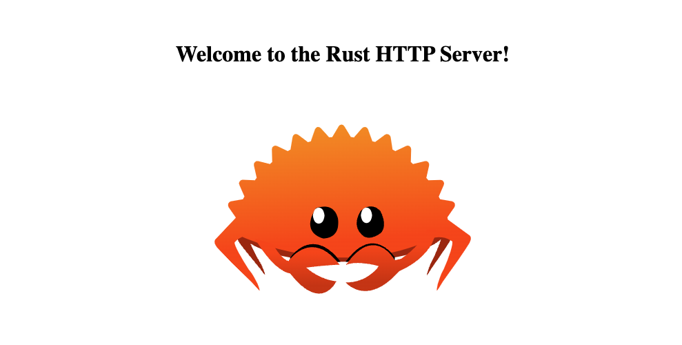

# rust-http

[](https://www.rust-lang.org) [](https://pre-commit.com)

This repository contains a simple implementation of an HTTP server using Rust.  It is intended to be used as a tool for learning the basics of Rust, intentionally leaving some of the basic server functionality unimplemented so that developers can build off of this implementation and further their understanding of Rust.



## Table of Contents

- [Getting Started](#getting-started)
  - [Prerequisites](#prerequisites)
  - [Local Development Guide](#local-development-guide)
  - [Other Commands](#other-commands)
- [Next Steps](#next-steps)
  - [Headers](#headers)
  - [Server Performance](#server-performance)
  - [Asynchronous Rust](#asynchronous-rust)

## Getting Started

This section provides supporting steps and documentation for developing locally.

### Prerequisites

Before jumping into the code, there are a few prerequisites.

1. Local development should be done from a UNIX-based machine - use Linux, MacOS, or WSL2 if you're on a Windows machine.

2. GitHub access should be managed through an SSH key in your UNIX environment. If you're unfamiliar with this process [start here](https://docs.github.com/en/authentication/connecting-to-github-with-ssh).

3. [pre-commit](https://pre-commit.com/) should be installed globally on your machine for linting and validating your code prior to pushing up to GitHub.

4. [Rust](https://www.rust-lang.org/tools/install) should be installed globally on your machine for compiling and running code.

5. Optionally, the [Rust-Analyzer](https://marketplace.visualstudio.com/items?itemName=rust-lang.rust-analyzer) extension can be installed in VS Code for a better development experience.

### Local Development Guide

1. Clone the repository (if this is your first time).

    ```sh
    git clone git@github.com:dgonzo27/rust-http.git
    ```

2. Navigate into the repository directory.

    ```sh
    cd rust-http
    ```

3. Ensure pre-commit is enabled for this repository.

    ```sh
    pre-commit install
    ```

4. Compile the Rust code.

    ```sh
    cargo build
    ```

5. Run the Rust code.

    ```sh
    cargo run
    ```

6. Test out the routes defined in `src/website_handler.rs` from your browser.

    - [127.0.0.1:8080](127.0.0.1:8080)

    - [127.0.0.1:8080/hello](127.0.0.1:8080/hello)

7. Test out a traversal attack from a new terminal window.

    ```sh
    echo "GET /../../../../../proc/meminfo HTTP/1.1\r\n" | nc 127.0.0.1 8080
    ```

8. Stop the server.

    ```sh
    ctrl + c
    ```

### Other Commands

1. Run pre-commit against all files.

    ```sh
    pre-commit run --all-files
    ```

## Next Steps

This section provides guidance on furthering this solution to make it more robust.

### Headers

HTTP requests and responses are implemented in the `src/http/request.rs` and `src/http/response.rs` files, respectively.  Line 33 of the `src/http/request.rs` file shows an example string slice we can expect to receive from our request buffer:

```txt
GET /search?name=rustacean&sort=1 HTTP/1.1\r\nHEADERS
```

In our current implementation, the HTTP headers are ignored in both the request and response.  A great first task would be to extend the implementation so that these headers can be read and returned properly.

### Server Performance

The implementation of our server exists in the `src/server.rs` file.  This implementation is based on a single thread, which is not best practice in a production-scenario.  Explore the [thread](https://doc.rust-lang.org/std/thread/index.html) and [sync](https://doc.rust-lang.org/std/sync/index.html) modules from the Rust standard library and convert the single-threaded server into a multi-threaded server.

### Asynchronous Rust

After getting familiar with multi-threaded principles, you are encouraged to dive into the world of [asynchronous Rust](https://rust-lang.github.io/async-book/03_async_await/01_chapter.html).  A popular asynchronous runtime for Rust is called [Tokio](https://tokio.rs).  It's been built and used by large organizations like AWS, Azure, Discord, Facebook, Dropbox and more - so be sure to check it out!
